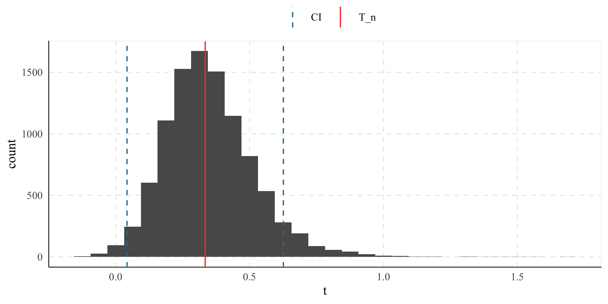

<!-- README.md is generated from README.Rmd. Please edit that file -->

# tidydelta

<!-- badges: start -->
<!-- badges: end -->

Delta Method implementation to estimate standard errors in a {tidyverse}
workflow.

## Installation

You can install the development version of tidydelta from
[GitHub](https://github.com/JavierMtzRdz/tidydelta) with:

``` r
remotes::install_github("JavierMtzRdz/tidydelta")
# Or
devtools::install_github("JavierMtzRdz/tidydelta")  
```

## Theoretical Background

In general terms, the Delta Method provides a tool for approximating the
behaviour of an estimator $\phi(T_n)$ using Taylor Expansion, where
$T_n$ is an estimator of a parameter $\theta$, and $\phi$ is a function.
To derive this result, we should begin with the observation that,
according to the continuous mapping theorem, if
$T_n \xrightarrow{\mathbb{P}} \theta$ implies
$\phi(T_n) \xrightarrow{\mathbb{P}} \phi(\theta)$ assuming that $\phi$
is a continuous function (Vaart 2000, 25).

This observation allows us to take a step forward to decompose the
theorem of the DM. Assuming that $\phi$ is not only continuous but also
differentiable and further assuming that $\sqrt{n} (T_n - \theta)$
converges in distribution to a variable $T$ as the sample size $n$
increases, (Bouchard-Côté n.d., 87) we can employ Taylor Expansion to
show that

$$
\sqrt{n} (\phi(T_n) - \phi(\theta)) \approx \phi'(\theta)\sqrt{n} (T_n - \theta).
$$

Now, as the sample size $n$ becomes larger, the expression
$\sqrt{n} (\phi(T_n) - \phi(\theta))$ converges in distribution to
$\phi'(\theta)T$ (Vaart 2000, 25; Bouchard-Côté n.d.).

Given the previous result, we can rearrange the equations to show that

$$
\sqrt{n} (\phi(T_n) - \phi(\theta)) \sim N(0, \phi'(\theta)^2\sigma^2)
$$

as $n$ grows larger. For this reason, it is not a surprise that one of
the primary uses of the Delta Method is to approximate the variance of
transformations of estimators.

### The Multivariate Case

We often encounter scenarios where our $\theta$ can be expressed as a
function of more than one parameter. For instance, we may be interested
in the transformation $\phi$ of $\theta = (\theta_1, \ldots, \theta_k)$
(Zepeda-Tello et al. 2022). In this case, we are dealing with a
multivariate parameter space and the estimator
$T_{n,k} = (Y_{n,1}, \ldots, Y_{n,k})$ becomes a random vector.
Consequently, the asymptotic behaviour of the estimator $T_{n,k}$ can be
seen as follows (Weisberg 2005, 79–80)

$$
\sqrt{n} (T_{n,k} - \theta) \leadsto N(0, \Sigma).
$$

To approximate this scenario using the Delta Method, we need to compute
the vector of all partial derivatives of $\phi(\theta)$ with respect to
each parameter $\theta_1, \ldots, \theta_k$. This vector is denoted as
$\nabla \phi$. With this vector, we can extend the Delta Method to the
multivariate case stating that asymptotically

$$
\sqrt{n} (\phi(T_{n,k}) - \phi(\theta)) \leadsto N(0, \nabla_{\theta}^\top\Sigma \nabla_{\theta}).
$$

In this equation, $\nabla_{\theta}^\top$ represents the transpose of the
gradient vector $\nabla \phi$, and $\Sigma$ is the covariance matrix of
the random vector $T_{nk}$ (Weisberg 2005, 79–80).From this, we obtain
that $se(\theta) = \sqrt{\nabla_{\theta}^\top\Sigma \nabla_{\theta}}$,
which constitutes the function that is being implemented in this
project.

## Example

Using tidydelta(), the following commands are equivalent:

``` r
# Load packages
library(tidydelta)
library(tidyverse)

# Simulate samples
set.seed(547)
x <- rnorm(10000, mean = 5, sd = 2)
y <- rnorm(10000, mean = 15, sd = 3)

bd <- tibble(x, y)

# Equivalent uses of tidydelta()
tidydelta(~ y / x,
  conf_lev = .95
)
#> # A tibble: 1 × 6
#>       y     x   T_n    se lower_ci upper_ci
#>   <dbl> <dbl> <dbl> <dbl>    <dbl>    <dbl>
#> 1  15.0  5.02  2.99  1.33    0.378     5.61

tidydelta(~ bd$y / bd$x,
  conf_lev = .95
)
#> # A tibble: 1 × 6
#>       y     x   T_n    se lower_ci upper_ci
#>   <dbl> <dbl> <dbl> <dbl>    <dbl>    <dbl>
#> 1  15.0  5.02  2.99  1.33    0.378     5.61
bd %>%
  summarise(tidydelta(~ y / x,
    conf_lev = .95
  ))
#> # A tibble: 1 × 6
#>       y     x   T_n    se lower_ci upper_ci
#>   <dbl> <dbl> <dbl> <dbl>    <dbl>    <dbl>
#> 1  15.0  5.02  2.99  1.33    0.378     5.61
```

Now, the data frame is divided into samples to compare the
transformation of the sample with the estimation of `tidydelta()`. In
the real world, you would not need to compute the Delta Method if you
have many samples, but it shows how it can be incorporated in a workflow
with tidyverse.

``` r
(result <- bd %>%
  summarise(tidydelta(~ x / y,
    conf_lev = .95
  )))
#> # A tibble: 1 × 6
#>       x     y   T_n    se lower_ci upper_ci
#>   <dbl> <dbl> <dbl> <dbl>    <dbl>    <dbl>
#> 1  5.02  15.0 0.334 0.149   0.0422    0.626

ggplot() +
  geom_histogram(
    data = bd %>%
      mutate(t = x / y),
    aes(x = t)
  ) +
  geom_vline(aes(
    xintercept = result$T_n,
    color = "T_n"
  )) +
  geom_vline(
    aes(
      xintercept = c(
        result$lower_ci,
        result$upper_ci
      ),
      color = "CI"
    ),
    linetype = "dashed"
  ) +
  labs(color = element_blank())
```



## References

<div id="refs" class="references csl-bib-body hanging-indent"
entry-spacing="0">

<div id="ref-Bouchard-Cote:2023" class="csl-entry">

Bouchard-Côté, Alexandre. n.d. *Probability, Illustrated*. Accessed
October 25, 2023.

</div>

<div id="ref-Vaart:2000a" class="csl-entry">

Vaart, A. W. van der. 2000. *Asymptotic Statistics*. Cambridge Series in
Statistical and Probabilistic Mathematics. Cambridge University Press.

</div>

<div id="ref-Weisberg:2005" class="csl-entry">

Weisberg, Sanford. 2005. *Applied Linear Regression*. 3rd ed. Hoboken
NJ: Wiley.

</div>

<div id="ref-Zepeda-TelloSchomakerMaringe:2022" class="csl-entry">

Zepeda-Tello, Rodrigo, Michael Schomaker, Camille Maringe, Matthew J.
Smith, Aurelien Belot, Bernard Rachet, Mireille E. Schnitzer, and Miguel
Angel Luque-Fernandez. 2022. “The Delta-Method and Influence Function in
Medical Statistics: A Reproducible Tutorial.” arXiv.
<https://arxiv.org/abs/2206.15310>.

</div>

</div>
